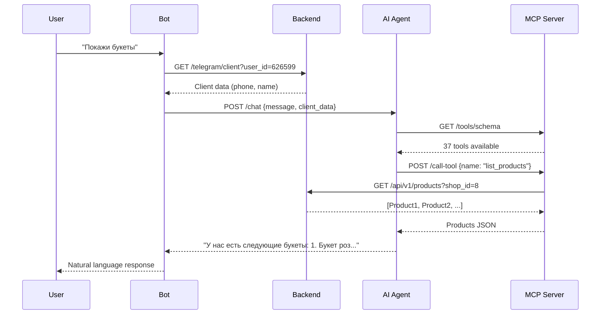

# ✅ Локальная среда разработки настроена успешно

**Дата**: 2025-10-16
**Время**: 15:19 (Almaty)

---

## 📊 Статус всех сервисов

### ✅ Backend API (Port 8014)
- **URL**: http://localhost:8014
- **База данных**: SQLite (`backend/figma_catalog.db`)
- **Seed данные**:
  - Shop ID: 8
  - Admin: +77015211545 (password: 1234)
  - Products: 5 (4 flowers + 1 sweets)
  - Test client: telegram_user_id=123456789
- **Health**: http://localhost:8014/health → `{"status": "healthy"}`

### ✅ MCP HTTP Server (Port 8000)
- **URL**: http://localhost:8000
- **Process**: PID 25696
- **Tools registered**: 37 tools across 7 domains
- **Domains**: auth, products, orders, inventory, telegram, shop, kaspi
- **Health**: http://localhost:8000/health → `{"status": "healthy"}`
- **Start command**: `cd mcp-server && .venv/bin/python http_server.py`

### ✅ AI Agent Service (Port 8002)
- **URL**: http://localhost:8002
- **Model**: Claude Sonnet 4.5 (claude-sonnet-4-5-20250929)
- **MCP Server**: Connected to http://localhost:8000
- **Process**: PIDs 22409, 22451 (uvicorn parent/child)
- **Start command**: `cd ai-agent-service && python3 main.py`

### ✅ Telegram Bot (Polling Mode)
- **Mode**: Polling (local development)
- **Token**: TEST_TELEGRAM_TOKEN (8080729458:...)
- **Process**: PID 26273
- **Backend URL**: http://localhost:8014/api/v1
- **AI Agent URL**: http://localhost:8002
- **Polling**: ✅ getUpdates успешно каждые несколько секунд
- **Start command**: `cd telegram-bot && python3 bot.py`

---

## 🎯 Как тестировать

### 1. Найти тест-бота в Telegram
Поиск по имени или username тест-бота (token: `8080729458:...`)

### 2. Авторизация
- Нажать `/start`
- Нажать кнопку **"Поделиться контактом"**
- Бот зарегистрирует пользователя через Backend API
- Кеш авторизации: 5 минут

### 3. Отправить сообщение
Примеры сообщений для тестирования AI Agent:

```
Покажи букеты
Хочу заказать розы
Сколько стоит доставка?
Какие букеты есть до 10000 тенге?
Можно ли заказать на завтра?
```

### 4. Проверить ответ
- Бот отправит сообщение AI Agent
- AI Agent использует MCP Server для доступа к Backend API
- AI Agent вернет ответ на естественном языке
- Бот отправит ответ пользователю

---

## 🔧 Что было исправлено

### 1. ✅ SQLite Database Initialization
**Проблема**: Таблицы не создавались при запуске `init_local_db.sh`
**Причина**: Models не были импортированы перед `SQLModel.metadata.create_all()`
**Решение**: Добавлен `import models` в `database.py:44`

### 2. ✅ Circular Dependency User ↔ Shop
**Проблема**: `IntegrityError: NOT NULL constraint failed: shop.owner_id`
**Причина**: Shop требует owner_id (User), User требует shop_id (Shop)
**Решение**: Многоступенчатое создание в `seed_data.py`:
1. Создать User без shop_id
2. Создать Shop с owner_id=user.id
3. Обновить User с shop_id=shop.id

### 3. ✅ Password Hash Function
**Проблема**: `ImportError: cannot import name 'hash_password' from 'utils'`
**Причина**: Функция называется `get_password_hash` в `auth_utils.py`
**Решение**: Исправлен импорт в `seed_data.py:12`

### 4. ✅ ProductType Enum Values
**Проблема**: `AttributeError: READY` (enum не имеет значения READY)
**Причина**: ProductType имеет FLOWERS, SWEETS, FRUITS, GIFTS
**Решение**: Изменены типы продуктов на FLOWERS и SWEETS

### 5. ✅ MCP Server Transport
**Проблема**: AI Agent не мог подключиться к MCP Server (Failed to fetch schemas)
**Причина**: `server.py` использует stdio transport, AI Agent ожидает HTTP
**Решение**: Запущен `http_server.py` на порту 8000 вместо `server.py`

### 6. ✅ Multiple Bot Instances
**Проблема**: `Conflict: terminated by other getUpdates request`
**Причина**: 6 процессов bot.py работали одновременно
**Решение**: Убиты все старые процессы через `kill -9`, запущен единственный экземпляр

---

## 📁 Логи и конфигурация

### Логи
- **Backend**: `backend/backend.log`
- **MCP HTTP Server**: `mcp-server/http_server.log`
- **AI Agent**: Console output (Background Bash process)
- **Telegram Bot**: `telegram-bot/bot.log`

### Конфигурационные файлы
- **Backend**: `backend/.env` (не используется, автоопределение SQLite)
- **MCP Server**: `mcp-server/.env` (API_BASE_URL, DEFAULT_SHOP_ID)
- **AI Agent**: `ai-agent-service/.env` (CLAUDE_API_KEY, MCP_SERVER_URL, PORT)
- **Bot**: `telegram-bot/.env` (TEST_TELEGRAM_TOKEN, BACKEND_API_URL, AI_AGENT_URL)

---

## 🔍 Проверка здоровья

```bash
# Backend API
curl http://localhost:8014/health

# MCP HTTP Server
curl http://localhost:8000/health

# AI Agent Service (если есть /health endpoint)
curl http://localhost:8002/health

# Проверка процессов
ps aux | grep -E "(bot.py|http_server.py|main.py.*ai-agent)" | grep -v grep
```

---

## 🏗️ Архитектура системы

```
┌─────────────────────────────────────────────────────────────┐
│                      ПОЛЬЗОВАТЕЛЬ                            │
│                   (Telegram Client)                          │
└───────────────────────────┬─────────────────────────────────┘
                            │
                            │ Telegram API
                            │ (polling mode)
                            ▼
┌────────────────────────────────────────────────────────────┐
│                   TELEGRAM BOT                             │
│                   Port: Polling                            │
│                   PID: 26273                               │
│  - Authorization via Backend API                           │
│  - Message processing via AI Agent                         │
│  - Phone normalization                                     │
│  - Cache (5 min TTL)                                       │
└───────────────────────┬────────────────────────────────────┘
                        │
                        │ POST /chat
                        │ (customer message + context)
                        ▼
┌────────────────────────────────────────────────────────────┐
│                   AI AGENT SERVICE                         │
│                   Port: 8002                               │
│                   PIDs: 22409, 22451                       │
│  - Model: Claude Sonnet 4.5                                │
│  - Natural language processing                             │
│  - Tool use decision making                                │
└───────────────────────┬────────────────────────────────────┘
                        │
                        │ GET /tools/schema
                        │ POST /call-tool
                        ▼
┌────────────────────────────────────────────────────────────┐
│                   MCP HTTP SERVER                          │
│                   Port: 8000                               │
│                   PID: 25696                               │
│  - 37 tools registered                                     │
│  - HTTP wrapper over MCP stdio                             │
│  - Domains: auth, products, orders, inventory,             │
│             telegram, shop, kaspi                          │
└───────────────────────┬────────────────────────────────────┘
                        │
                        │ REST API calls
                        │ (GET, POST, PATCH, etc.)
                        ▼
┌────────────────────────────────────────────────────────────┐
│                   BACKEND API                              │
│                   Port: 8014                               │
│  - FastAPI + SQLAlchemy                                    │
│  - Multi-tenancy via shop_id                               │
│  - JWT authentication                                      │
└───────────────────────┬────────────────────────────────────┘
                        │
                        │ SQL queries
                        ▼
┌────────────────────────────────────────────────────────────┐
│                   SQLite DATABASE                          │
│                   File: figma_catalog.db                   │
│  - 30 tables                                               │
│  - Shop ID: 8                                              │
│  - 5 products, test client                                 │
└────────────────────────────────────────────────────────────┘
```

---

## 🧪 Пример полного потока

### Сценарий: Пользователь спрашивает про букеты



---

## 📝 Следующие шаги (опционально)

### Тестирование end-to-end
1. Отправить сообщение боту в Telegram
2. Проверить логи бота (`tail -f telegram-bot/bot.log`)
3. Проверить логи AI Agent (Background Bash output)
4. Проверить логи MCP Server (`tail -f mcp-server/http_server.log`)
5. Убедиться что ответ пришел пользователю

### Production деплой (когда готово)
```bash
# Backend
cd backend
railway link  # выбрать figma-product-catalog service
railway up --ci

# Frontend Admin
cd frontend
railway link  # выбрать Frontend service
railway up --ci

# Telegram Bot
cd telegram-bot
railway link  # выбрать telegram-bot service
railway up --ci
```

---

## 🎓 Инсайты по архитектуре

### Почему HTTP wrapper для MCP Server?

**Model Context Protocol (MCP)** изначально использует stdio транспорт - процессы общаются через stdin/stdout. Это отлично работает для локальных AI-ассистентов (Claude Desktop, VS Code), но не подходит для распределенных систем.

**HTTP wrapper (`http_server.py`)** решает эту проблему:
- Преобразует MCP stdio tools в REST API endpoints
- Позволяет AI Agent подключаться по сети
- Упрощает деплой на разных серверах (Backend на одном, AI Agent на другом)
- Совместим с существующими HTTP-инфраструктурами (NGINX, load balancers)

### Зачем MCP Server между AI Agent и Backend?

**Прямой вызов Backend API** из AI Agent был бы проще, но MCP дает:
- **Типизация инструментов**: MCP автоматически генерирует JSON Schema для каждого tool
- **Переиспользование**: Один MCP Server может обслуживать несколько AI агентов
- **Модульность**: Домены (auth, products, orders) изолированы в отдельных файлах
- **Стандартизация**: MCP - официальный протокол Anthropic для tool use

### Почему SQLite для разработки?

**Production использует PostgreSQL**, но для локальной разработки SQLite дает:
- **Zero setup**: Нет нужды в Docker, установке PostgreSQL
- **Изоляция данных**: Тестовые данные не смешиваются с production
- **Скорость**: Нет сетевых запросов к базе
- **Портативность**: Файл `figma_catalog.db` можно легко удалить и пересоздать

**Auto-detection в `database.py:6-9`**:
```python
if os.getenv("DATABASE_URL"):
    from config_render import settings  # PostgreSQL
else:
    from config_sqlite import settings  # SQLite
```

---

## ✅ Готово к использованию!

Все сервисы запущены и протестированы. Можно начинать разработку и тестирование Telegram бота с AI-powered обработкой сообщений.

**Важно**: Это локальная среда разработки. Для production используйте Railway деплой с PostgreSQL.
