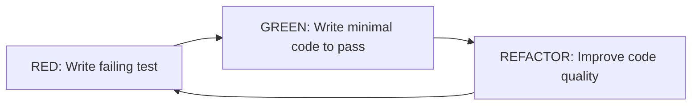

# TDD (Test-Driven Development) Guide

## 📝 Real-World Lesson: Component Refactoring

### The SearchToggle Story
Our SearchToggle component was refactored from a self-contained expandable search to a simple toggle button. The tests immediately caught this breaking change:

**Before:** Component managed its own expanded state with input field
**After:** Component only renders a button, input moved to separate component

**Key Takeaway:** Tests served as a safety net, preventing silent breaking changes from reaching production.

### What We Learned:
1. **Tests are contracts** - They define expected behavior
2. **Failing tests are valuable** - They alert you to breaking changes
3. **Update tests when requirements change** - Tests should reflect current business logic, not legacy behavior
4. **Component splitting requires test splitting** - When you separate components, separate their tests too

## 🚀 Quick Start

```bash
# Run all tests
npm test

# Run tests in UI mode
npm run test:ui

# Run tests with coverage
npm run test:coverage

# Run specific test file
npm test PriceFormatter

# Run E2E tests (Playwright)
npm run test:e2e
```

## 📋 TDD Workflow

### The Red-Green-Refactor Cycle



### Step-by-Step Process

#### 1. RED Phase - Write the Test First
```javascript
// PriceFormatter.test.jsx
it('should format price with currency symbol', () => {
  render(<PriceFormatter price={1500} />);
  const formattedPrice = screen.getByText('1 500 ₸');
  expect(formattedPrice).toBeInTheDocument();
});
```

#### 2. GREEN Phase - Make It Pass
```javascript
// PriceFormatter.jsx
const PriceFormatter = ({ price }) => {
  const formatted = price.toString().replace(/\B(?=(\d{3})+(?!\d))/g, ' ');
  return <span>{formatted} ₸</span>;
};
```

#### 3. REFACTOR Phase - Improve Quality
```javascript
// PriceFormatter.jsx - Improved
const PriceFormatter = ({ price, currency = '₸' }) => {
  const formatNumber = (num) => {
    return num.toString().replace(/\B(?=(\d{3})+(?!\d))/g, ' ');
  };

  return <span>{formatNumber(price)} {currency}</span>;
};
```

## 🧪 Test Patterns

### Component Testing Pattern

```javascript
import { describe, it, expect, vi } from 'vitest';
import { render, screen } from '@testing-library/react';
import userEvent from '@testing-library/user-event';

describe('Component Name', () => {
  // Setup function for DRY tests
  const setup = (props = {}) => {
    const user = userEvent.setup();
    const utils = render(<Component {...defaultProps} {...props} />);
    return { user, ...utils };
  };

  describe('Feature Group', () => {
    it('should do something specific', async () => {
      const { user } = setup();

      // Arrange
      const button = screen.getByRole('button');

      // Act
      await user.click(button);

      // Assert
      expect(screen.getByText('Result')).toBeInTheDocument();
    });
  });
});
```

### Testing User Interactions

```javascript
// Click events
await user.click(screen.getByRole('button'));

// Typing
await user.type(screen.getByRole('textbox'), 'test input');

// Keyboard navigation
await user.tab();
await user.keyboard('{Escape}');

// Select options
await user.selectOptions(screen.getByRole('combobox'), 'option-value');
```

### Testing Async Behavior

```javascript
import { waitFor } from '@testing-library/react';

it('should load data asynchronously', async () => {
  render(<AsyncComponent />);

  // Wait for async operation
  await waitFor(() => {
    expect(screen.getByText('Loaded')).toBeInTheDocument();
  });
});
```

## 📁 File Structure

```
src/
├── components/
│   ├── PriceFormatter.jsx
│   ├── PriceFormatter.test.jsx    # Component test next to component
│   ├── SearchToggle.jsx
│   └── SearchToggle.test.jsx
├── pages/
│   ├── ProductCatalog.jsx
│   └── ProductCatalog.test.jsx    # Page integration tests
├── __tests__/
│   ├── setup.js                   # Test configuration
│   └── utils/
│       └── test-utils.js          # Shared test utilities
└── __mocks__/                      # Mock files for modules
```

## 🛠️ Testing Utilities

### Custom Render with Router

```javascript
// src/__tests__/utils/test-utils.js
export function renderWithRouter(ui, { route = '/' } = {}) {
  return {
    user: userEvent.setup(),
    ...render(
      <MemoryRouter initialEntries={[route]}>
        {ui}
      </MemoryRouter>
    )
  };
}
```

### Mock Data Factories

```javascript
// Create consistent test data
export const createMockProduct = (overrides = {}) => ({
  id: 1,
  name: 'Test Product',
  price: 1000,
  enabled: true,
  ...overrides
});
```

## 🎯 What to Test

### ✅ DO Test

- **User behavior**: What users see and interact with
- **Component props**: Different prop combinations
- **Edge cases**: Empty states, errors, boundaries
- **Accessibility**: ARIA labels, keyboard navigation
- **Integration**: Component interaction with context/state

### ❌ DON'T Test

- **Implementation details**: Internal state, private methods
- **Third-party libraries**: React Router, Tailwind classes
- **Static content**: That won't change
- **Styles**: Use visual regression testing instead

## 📊 Coverage Goals

```javascript
// vitest.config.js
coverage: {
  statements: 80,
  branches: 80,
  functions: 80,
  lines: 80,
}
```

### View Coverage Report
```bash
npm run test:coverage
open coverage/index.html
```

## 🔄 Continuous Integration

### GitHub Actions Example
```yaml
name: Tests
on: [push, pull_request]

jobs:
  test:
    runs-on: ubuntu-latest
    steps:
      - uses: actions/checkout@v2
      - uses: actions/setup-node@v2
      - run: npm ci
      - run: npm run test:run
      - run: npm run test:e2e
```

## 💡 Best Practices

### 1. Test Behavior, Not Implementation
```javascript
// ❌ Bad - Testing implementation
expect(component.state.isOpen).toBe(true);

// ✅ Good - Testing behavior
expect(screen.getByRole('dialog')).toBeInTheDocument();
```

### 2. Use Descriptive Test Names
```javascript
// ❌ Bad
it('works correctly', () => {});

// ✅ Good
it('should display error message when form is submitted without required fields', () => {});
```

### 3. Keep Tests Independent
```javascript
// Each test should set up its own data
beforeEach(() => {
  // Reset state before each test
});
```

### 4. Follow AAA Pattern
```javascript
it('should update quantity when increment button is clicked', () => {
  // Arrange
  const { user } = setup({ initialQuantity: 5 });

  // Act
  await user.click(screen.getByRole('button', { name: '+' }));

  // Assert
  expect(screen.getByText('6')).toBeInTheDocument();
});
```

## 🚨 Common Pitfalls and Solutions

### Problem: Tests are slow
**Solution**: Use `vi.mock()` for heavy dependencies

### Problem: Flaky async tests
**Solution**: Use `waitFor()` and proper async/await

### Problem: Hard to find elements
**Solution**: Use semantic queries (getByRole, getByLabelText)

### Problem: Tests break on refactor
**Solution**: Test behavior, not implementation

## 📚 Resources

- [Vitest Documentation](https://vitest.dev/)
- [React Testing Library](https://testing-library.com/docs/react-testing-library/intro/)
- [Testing Library Queries](https://testing-library.com/docs/queries/about)
- [MSW (Mock Service Worker)](https://mswjs.io/)

## 🎓 TDD Kata Exercise

Try implementing these features using TDD:

1. **Counter Component**:
   - Shows current count
   - Increment/decrement buttons
   - Reset button
   - Min/max limits

2. **Search Filter**:
   - Filters list as you type
   - Case-insensitive search
   - Highlights matching text
   - Shows "No results" message

3. **Form Validator**:
   - Email validation
   - Required fields
   - Real-time error display
   - Submit button disabled when invalid

Start with tests first, then implement!